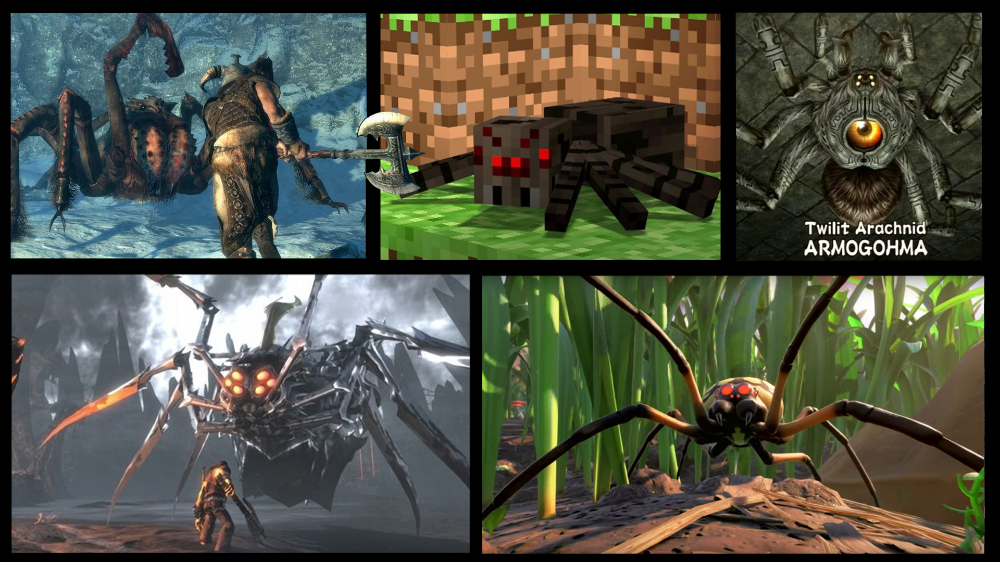

## Welcome to my profile
About me:
- :mortar_board: Studing at [UEL](http://portal.uel.br/home) in Brazil.
- :computer: Java Script Full Stack Developer.
- :envelope: How to contact me: 
  - e-mail: guto_phs@hotmail.com
  - institutional e-mail: pedroaugusto.phs@uel.br
- :video_game: Top 10 games of my life (Until now):
  - BattleField 3
  - Call of duty Black ops 2
  - Crash bandicoot Trilogy
  - Cs:go
  - Gta V
  - League of Legends
  - Minecraft
  - Rust
  - Skyrim
  - The Last of Us
  
## Why does 99% of the game have spiders?

  

## 🛠 &nbsp;Tech Stack

&nbsp;
&nbsp;
&nbsp;
&nbsp;
&nbsp;
&nbsp;
&nbsp;
&nbsp;
&nbsp;

## :zap: Git hub stats!

  
  

